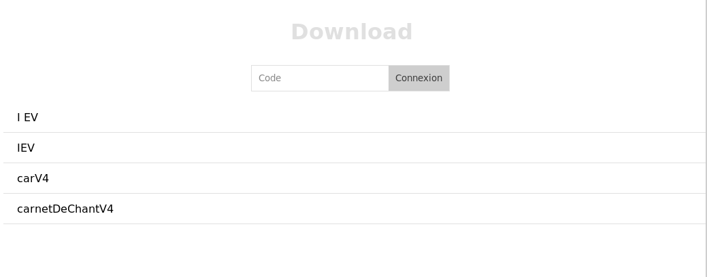

# file-downloader

simple php file downloader, not folders (dev : 1 hour)

# use

* edit files.json with files list and password
* edit index.php to add a global password to view all files
* enjoy

